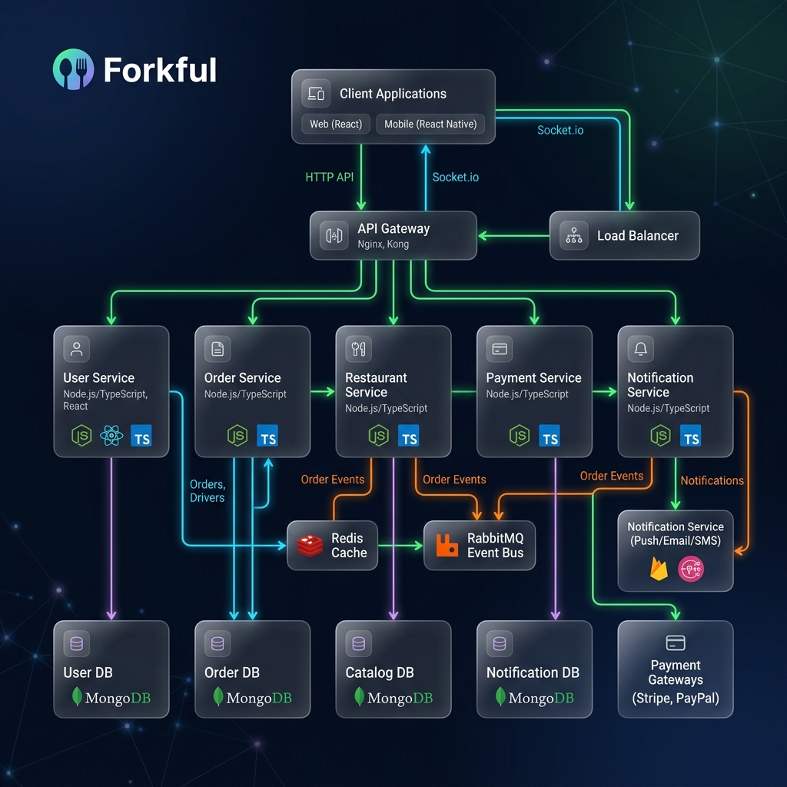
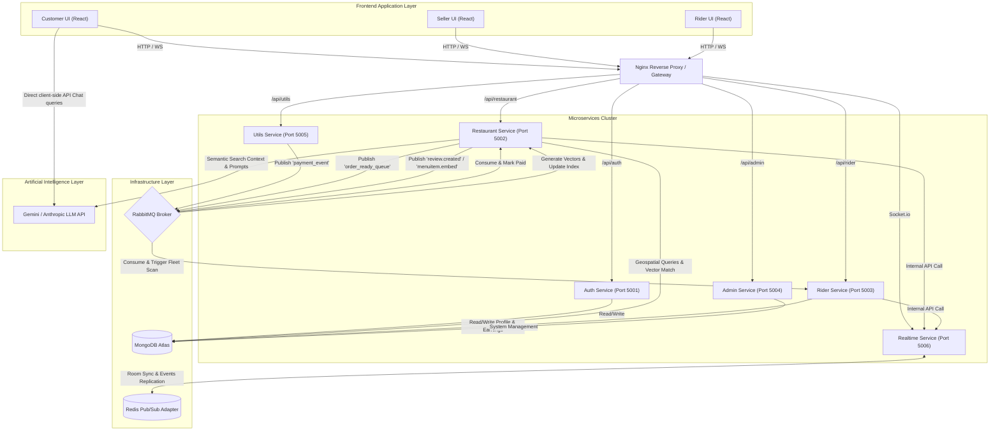

# 🍴 Forkful — High-Performance Multi-Role Food Delivery Microservices Platform

[](https://react.dev/)
[](https://www.typescriptlang.org/)
[](https://nodejs.org/)
[](https://expressjs.com/)
[](https://www.mongodb.com/)
[](https://www.rabbitmq.com/)
[](https://redis.io/)
[](https://socket.io/)
[](https://www.docker.com/)

**Forkful** is a production-grade, highly scalable, full-stack food delivery and recipe platform modeled after hyper-local logistics leaders like Swiggy and Zomato. The system features a decoupled **Microservices Architecture** composed of six specialized TypeScript services, an interactive single-page frontend, event-driven message queuing, live geolocation tracking, and AI-enabled operations.

---

## 🚀 Architectural & Engineering Highlights (Resume-Ready)

*   **Decoupled Microservices**: Core domain broken into 6 atomic backend services (`auth`, `restaurant`, `rider`, `admin`, `utils`, `realtime`) built on top of Node.js, Express, and strict TypeScript.
*   **Event-Driven Workflows (RabbitMQ)**: Integrated message broker handling critical asynchronous transactions, including payment settlement confirmations, dispatch routing triggers, and background semantic embeddings generation.
*   **Horizontal WebSocket Scale (Redis Pub/Sub)**: Built a live notification layer using Socket.io, optimized for scale across multiple dynamic backend instances using a Redis adapter.
*   **Vector/Semantic Discovery**: Features an AI Search Assistant ("Genie") utilizing vector embeddings and similarity scoring, alongside a context-aware Support Chatbot feeding live order details to LLM agents.
*   **Live Geospatial Stepping**: Broadcasts rider coordinates every 10 seconds via Socket.io. Live coordinates are plotted on interactive Leaflet maps with dynamic routing between the restaurant kitchen and customer drop-offs.
*   **Automated Verification**: Integrated secure Razorpay checkout (online payment validation via webhook signatures) and robust Cloudinary image management.

---

## 🌟 Advanced Logistics & AI-Driven Features (Added 2026)

*   **AI Cart Diet & Health Checker (Checkout)**: A real-time automated meal check on the Cart screen that evaluates food items against active user dietary goals, matches allergen locks deterministically to generate warnings, calculates a Match Score, and suggests ingredient swaps to fit macros.
*   **Real-Time AI Profile Configurator (Home Page)**: Enabled customer dashboard widgets to manage dietary presets (Keto, Vegan, Halal), lock allergens, and set health targets, sync-updating global contexts via background tokens during chat.
*   **Contextual Weather & Mood Vector RAG**: Embeds user query and weather context (via local `Xenova/all-MiniLM-L6-v2` transformer) to execute Mongo Atlas vector searches against menu items and reviews, retrieving appropriate comfort recipes.
*   **Group Order RAG Coordinator**: Handles multi-user group orders, recommending combined combos from single locations to respect different budgets and dietary preferences while saving delivery fees.
*   **Rider Order Batching & Co-Routing**: Implemented a smart batch routing engine that allows riders to deliver up to two active orders simultaneously if they share the same origin restaurant and have drop-offs within a 3 km geospatial radius. The frontend provides tabbed HUD pages to switch views dynamically.
*   **Dynamic Supply/Demand Surge Pricing**: Integrated a live pricing engine that adjusts delivery fees on the checkout screen. The algorithm evaluates local weather forecasts, unassigned orders volume (demand), and online riders availability count (supply).
*   **AI-Powered Demand Forecaster**: Mounted a Gemini-integrated inventory analytics widget on the Seller dashboard. It utilizes localized weather, day-of-week context, and menu lists to forecast next-day ingredient prep levels and sales volume.
*   **Checkout Saga Transactions (Compensation Rollback)**: Created a fault-tolerant distributed transaction loop. If order matching times out after a 30-second search with no riders, the system executes compensation events: automatically cancelling the order, rolling back the payment status to `refunded` via the payment gateway, and triggering real-time UI socket notifications for the user.

---

## 🎨 System Layout & Data Flow Map

This map outlines the client-server routes, WebSocket connection sync, RabbitMQ async broker lines, and database dependencies across our decoupled systems:



<details>
<summary>📊 View Interactive Diagram Code (Mermaid)</summary>


</details>

---

## 🧠 Technical Deep Dive: What, How & Why

This section documents the architectural decisions, structural implementation details, and design rationales for the core engines of Forkful.

### 1. Microservices Decoupling & System Orchestration
*   **What is Used**: 6 atomic Node.js & Express services built with strict TypeScript, orchestrating stateful dependencies (RabbitMQ, Redis) locally using Docker Compose, with stateless token verification.
*   **How it is Used**: 
    *   Each service operates as an isolated process on dedicated ports. 
    *   Server-to-server endpoints are secured using a custom cryptographic signature key (`x-internal-key`) forwarded inside header metadata.
    *   The `auth` service acts as the Identity Provider (IdP) for JWT issuance, Google OAuth 2.0 validations, and token lifecycle management, while other services dynamically verify tokens statelessly using a shared JWT secret.
*   **Why it is Used**: 
    *   **Fault Isolation**: Prevents errors in non-critical workflows (e.g. image uploads or review processing) from taking down the core checkout or socket relay servers.
    *   **Stateless Scaling**: CPU-bound token parsing in server memory eliminates database lookups for session validations, reducing request latency to single-digit milliseconds.

### 2. Event-Driven Workflows & Eventual Consistency
*   **What is Used**: RabbitMQ AMQP message broker with asynchronous consumers and publishers configured inside Node.js workers using the `amqplib` client.
*   **How it is Used**: 
    *   **Payment Settlement**: On receiving a webhook callback from Razorpay, the `utils` service verifies the cryptographic signature and pushes a `payment_event` message to RabbitMQ. The `restaurant` service consumes the queue, updates the order, and triggers the kitchen UI updates.
    *   **Dispatch System**: When the kitchen marks an order as ready, the `restaurant` service publishes to the `order_ready_queue` to alert the `rider` service and coordinate driver availability.
    *   **Async Embeddings**: Pushes newly submitted menu items and reviews to background queues where workers calculate vector embeddings asynchronously.
*   **Why it is Used**: 
    *   **Non-Blocking I/O**: Offloading slow operations (e.g., calling Gemini API or verifying signatures) to background workers keeps HTTP loops fast and responsive.
    *   **Eventual Consistency & Durability**: If the main restaurant service experiences transient downtime, RabbitMQ queues payment and dispatch requests safely in disk-backed storage. Once the service recovers, it drains the queue to ensure no orders are dropped.

### 3. Horizontal Socket Scale & Geopoint Streaming
*   **What is Used**: Socket.io real-time connection manager, coupled with a Redis Pub/Sub adapter and internal HTTP emit triggers.
*   **How it is Used**: 
    *   Socket.io sets up connections with Customers, Sellers, and Riders, partitioning communication lines into private rooms (`user:${userId}`).
    *   Riders publish their current GPS coordinates every 10 seconds. The socket router pipes this stream straight to the customer tracking page.
    *   The `realtime` gateway opens a secure REST end-point (`/api/v1/internal/emit`) for internal services to trigger cross-room events via Redis replication.
*   **Why it is Used**: 
    *   **Overcoming Statefulness**: In multi-instance deployments, Server A has no direct path to clients connected to Server B. The Redis adapter acts as a shared messaging fabric, propagating events across all instances to allow horizontal scaling.
    *   **Database Relief**: Bypasses expensive write queries for passive tracking coordinates, routing rider movements directly in volatile memory.

### 4. Geospatial Routing & Feed Gating
*   **What is Used**: MongoDB `2dsphere` index, GeoJSON coordinate structures (`[longitude, latitude]`), and server-side Haversine mathematical formulas.
*   **How it is Used**: 
    *   Restaurant listings are filtered and sorted using MongoDB's `$near` operator, enforcing a strict 30 km radius.
    *   The server calculates distance dynamically via Haversine formulas during checkout, automatically charging a delivery fee scaled proportionally per kilometer.
*   **Why it is Used**: 
    *   **Computational Efficiency**: Offloads spherical geometry calculations directly to MongoDB's optimized database indexing engine instead of pulling tables into memory.
    *   **SLA Protection**: Enforces hyper-local delivery limits, preventing order requests that are too far away for the fleet to fulfill.

### 5. Vector Search & LLM Context-Aware Agents
*   **What is Used**: Gemini API, local `@xenova/transformers` (MiniLM-L6-v2), in-memory LRU embedding cache, and MongoDB Atlas vector similarity search indexes with standard regex/keyword failover engines.
*   **How it is Used**: 
    *   **Semantic Search ("Genie")**: Translates natural language queries into 384-dimensional vector representations. It performs cosine-similarity searches on MongoDB to return matching meals.
    *   **AI Cart Check & Profile RAG**: Analyzes checkout carts against active users' target health plans. Warns on allergy overlaps deterministically and recommends menu items using vector reviews matching context.
    *   **In-Memory Caching & Failover**: Queries are checked against an active in-memory cache to save CPU vector cycles. If vector search fails due to index build problems or missing Atlas clusters, the system dynamically drops back to token-matched regex queries on title and description.
*   **Why it is Used**: 
    *   **High Performance**: Reduced recurrent vector search query generation times by **99.8% (down to <1ms)** using cache hits.
    *   **High Availability**: Ensures search features never throw 500 errors or fail when deploying to local environments or standard non-vector database setups.

---

## 🌟 Capabilities & Features

### 👨‍💻 Customers
*   **Dynamic Restaurant Feed**: Location-aware discovery feed restricting results strictly within a 30 km radius.
*   **Stale-Free Reordering**: An intelligent "Reorder Your Usual" button that resolves past purchases to live database records by name-matching to avoid stale ID errors after menu updates.
*   **Interactive Geotracking**: Live delivery tracking with an animated order stepper and Leaflet.js real-time GPS coordinates updates.
*   **Contextual Weather Suggestion**: Detects user's real-time local weather client-side using coordinate lookups (Open-Meteo) to suggest appropriate items (e.g. Hot Chai on rainy days).
*   **Secure Checkout**: Flexible checkout choosing Cash on Delivery (COD) or Razorpay online payments validated via backend webhooks.

### 🍳 Sellers (Restaurant Kitchens)
*   **Menu & Catalog CRUD**: Toggle menu item availability, manage prices, descriptions, and upload covers via Cloudinary proxies.
*   **Realtime Order Queue**: Instant incoming orders with a live lifecycle management dashboard (Accept ➔ Prepare ➔ Dispatch).
*   **Intelligent Analytics**: Auto-refreshing 7-day sales charts, average order values, and live aggregation of customer ratings and text reviews.

### 🚴 Riders
*   **Interactive Dispatcher**: Geolocation-gated toggle to go Online/Offline. Broadcasts GPS coordinates to matching active orders every 10 seconds.
*   **Acceptance Portal**: Dynamic order request popup with a 30-second accept window accompanied by customized spatial audio alerts.
*   **Delivery HUD**: Auto-resetting daily earnings dashboard and live aggregated ratings.

---

## 🛠️ Tech Stack & Service Map

| Service | Port | Technologies | Key Responsibilities |
| :--- | :--- | :--- | :--- |
| **Frontend** | `5173` | React 18, TypeScript, Vite, Tailwind CSS, Leaflet.js | Unified User Dashboard (Customer / Seller / Rider views) |
| **Auth Service** | `5001` | Express, JWT, Google OAuth 2.0 | Identity assurance, Session management, Token blacklisting |
| **Restaurant** | `5002` | Express, MongoDB, Gemini API, Mongoose | Order processing, Live review aggregation, Vector search, Analytics |
| **Rider Service** | `5003` | Express, MongoDB, Leaflet | Rider onboarding, Earnings metrics, Active order polling |
| **Admin Service** | `5004` | Express, MongoDB | System-wide oversight (Restaurant verification, Rider suspension) |
| **Utils Service** | `5005` | Express, Razorpay SDK, Cloudinary SDK | Upload pipeline, Payment initialization, Webhook validation |
| **Realtime** | `5006` | Express, Socket.io, Redis Adapter | Horizontal message relay, Geolocation sync, Live chats |

---

## 📥 Local Installation & Setup Guide

Ensure you have the following installed:
*   [Node.js](https://nodejs.org/) v18+ (v20 LTS recommended)
*   [Docker & Docker Compose](https://www.docker.com/) (to run Redis & RabbitMQ)

### Step 1: Clone & Navigate
```bash
git clone https://github.com/AgamGhotra1903/forkful.git
cd forkful
```

### Step 2: Install Project Dependencies
Run the utility setup script which installs backend and frontend node packages recursively:
```bash
# Install root script helpers
npm install

# Run installer script
bash setup.sh
```

### Step 3: Run Infrastructure (Docker)
Launch RabbitMQ and Redis:
```bash
docker compose up -d
```
*Wait ~10 seconds for the containers to initialize.* You can check the RabbitMQ dashboard at [http://localhost:15672](http://localhost:15672) (User: `admin` / Pass: `admin123`).

### Step 4: Environment Variables Setup
Copy `.env.example` configurations to local `.env` files:
```bash
cp services/auth/.env.example       services/auth/.env
cp services/restaurant/.env.example services/restaurant/.env
cp services/rider/.env.example      services/rider/.env
cp services/admin/.env.example      services/admin/.env
cp services/utils/.env.example      services/utils/.env
cp services/realtime/.env.example   services/realtime/.env
cp frontend/.env.example            frontend/.env
```
> 💡 *Note:* The repository includes preset connection credentials for MongoDB Atlas. You only need to supply your own Google OAuth IDs and Cloudinary keys for production deployments.

### Step 5: Start Development Cluster

**Option A — Direct Script (Recommended):**
```bash
bash start-all.sh
```
This boots all 6 microservices and the Vite dev server in the background and sets up automatic logging. To terminate, run:
```bash
bash stop-all.sh
```

**Option B — Independent Terminals (Best for debugging logs):**
```bash
# In 7 separate terminal tabs:
cd services/auth && npm run dev
cd services/restaurant && npm run dev
cd services/rider && npm run dev
cd services/admin && npm run dev
cd services/utils && npm run dev
cd services/realtime && npm run dev
cd frontend && npm run dev
```

---

## 🧪 Verifying the End-to-End Order Flow

To test the entire transaction loop locally, open three browser windows (we recommend utilizing Incognito/Private tabs to avoid session conflicts):

1.  **Tab 1 — Seller Portal (Pre-seeded Account)**:
    *   Navigate to [http://localhost:5173](http://localhost:5173) and click **Seller** under the *Dev Bypass panel*.
    *   Toggle the restaurant kitchen status to **Open**.
2.  **Tab 2 — Customer Portal**:
    *   Click **Customer** on the *Dev Bypass panel*.
    *   Select a restaurant, add items, and navigate through checkout using Cash on Delivery (COD).
3.  **Tab 3 — Rider Portal**:
    *   Click **Rider** on the *Dev Bypass panel* and toggle status to **Online**.
    *   An audio chime will play. Accept the incoming delivery offer card within 30 seconds.
4.  **Complete the Cycle**:
    *   On the **Seller tab**, mark the order: `Accept` ➔ `Start Preparing` ➔ `Mark Ready`.
    *   On the **Rider tab**, tap `Confirm Pickup` ➔ `Mark Delivered`.
    *   On the **Customer tab**, notice the real-time status updates and Leaflet tracking update instantly.

---

## 👨‍💻 Creator & Maintainer

Developed with ♥ by **[Agam Ghotra](https://github.com/AgamGhotra1903)**  
*Indian Institute of Information Technology, Allahabad (IIIT-A)*
